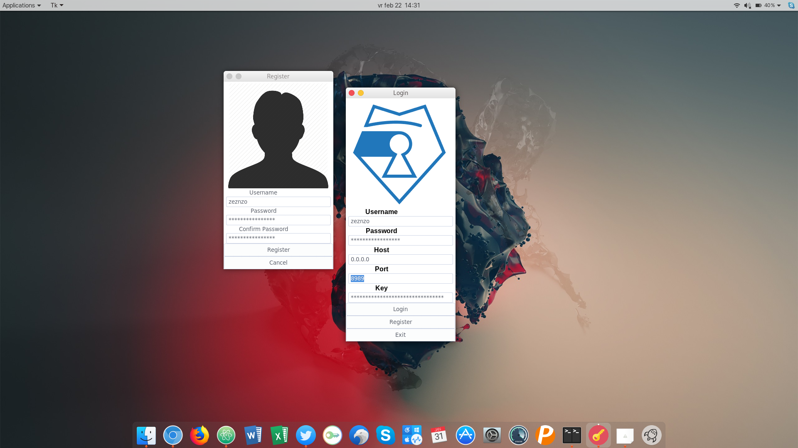
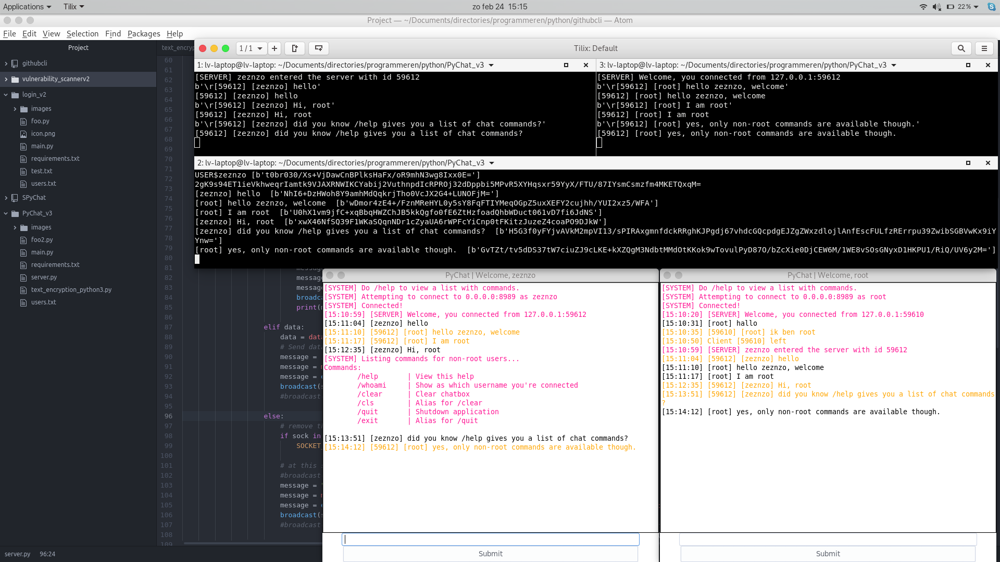

# PyChat_v3
Python 3 P2P chat application, secured with AES encryption

---
## [Version 3.0.3]
Chat works as expected and as it should, data is now encrypted with AES.
There is one known bug on closing the windows, that's why I coded a "press ESC to close" feature in it, so it won't trigger the bug on exiting the application.

---
## [Version 3.0.2]
Chat works but the all data is being send in plain text, not encrypted yet!

---
## [Version 3.0.1]
Only a concept application. Core code is missing, only the front-end works.

---

Installation:

Linux: 
```Shell
pip3 install -r requirements.txt
python3 main.py
```

Windows:
```Shell
pip3 install -r requirements.txt
py main.py
```
